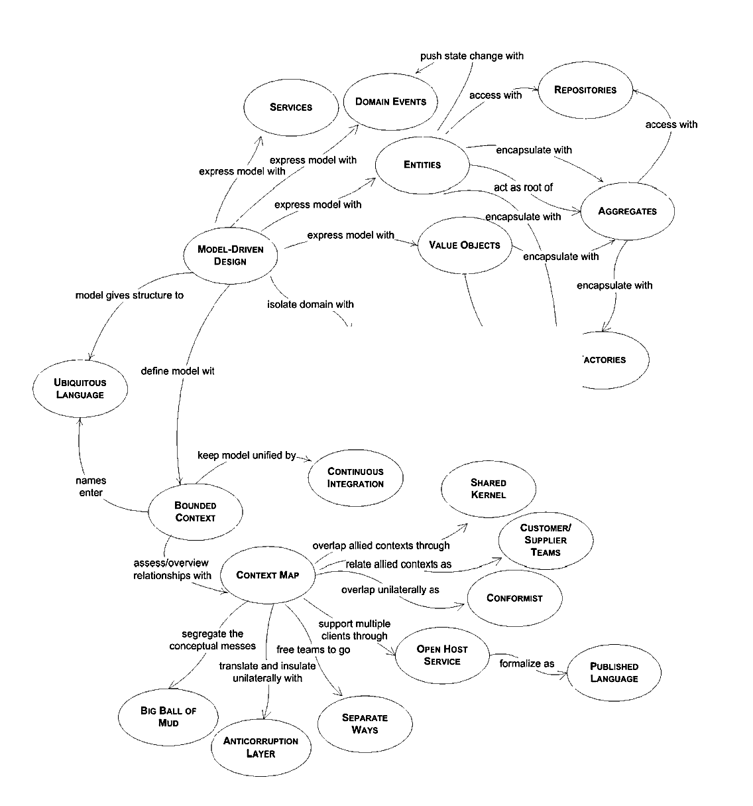

# learning "domain driven design reference"

领域驱动设计，不是一个新的概念，从Eric Evans 提出来之后，已经有将近10年的历史。

在微服务实现的过程中，领域驱动被广泛认可为最佳实践方法，但是落地的过程中，很多工程师在摆渡领域驱动理论的时候，几乎无从下手，甚至将其奉为天书一般的理论。

本文尽量将概念精简化，便于在实践过程中参考。但仍然晦涩难懂，所以要针对后续的实践项目，反复研读。

## Contents

* [致谢](#anchor01)
* [定义](#anchor02)
* [模式预览概览](#anchor03)
* [1. 让模型起作用](#anchor10)
  * [1.1 限界上下文](#anchor11)
  * [1.2 通用语言](#anchor12)
  * [1.3 持续集成](#anchor13)
  * [1.4 模型驱动设计](#anchor14)
  * [1.5 动手建模者](#anchor15)
  * [1.6 重构深入的洞察力](#anchor16)
* [2. 模型驱动设计的构建模块](#anchor20)
  * [2.1 分层架构](#anchor21)
  * [2.2 实体](#anchor22)
  * [2.3 值对象](#anchor23)
  * [2.4 领域事件](#anchor24)
  * [2.5 服务](#anchor25)
  * [2.6 模块](#anchor26)
  * [2.7 聚合](#anchor27)
  * [2.8 仓储](#anchor28)
  * [2.9 工厂](#anchor29)
* [3. 柔性设计](#anchor30)
  * [3.1 释意接口](#anchor31)
  * [3.2 无副作用方法](#anchor32)
  * [3.3 断言](#anchor33)
  * [3.4 孤立类](#anchor34)
  * [3.5 闭合操作](#anchor35)
  * [3.6 声明式设计](#anchor36)
  * [3.7 形式化的绘画](#anchor37)
  * [3.8 概念轮廓](#anchor38)
* [4. 为战略设计的上下文映射](#anchor40)
  * [4.1 上下文映射](#anchor41)
  * [4.2 合作关系*](#anchor42)
  * [4.3 共享内核](#anchor43)
  * [4.4 客户/供应商开发](#anchor44)
  * [4.5 顺从者](#anchor45)
  * [4.6 反腐层](#anchor46)
  * [4.7 开放主机服务](#anchor47)
  * [4.8 公共语言](#anchor48)
  * [4.9 分而治之](#anchor49)
  * [4.10 大泥球](#anchor410)
* [5. 提炼战略设计](#anchor50)
  * [5.1 核心领域](#anchor51)
  * [5.2 通用子域](#anchor52)
  * [5.3 领域愿景宣言](#anchor53)
  * [5.4 突出核心](#anchor54)
  * [5.5 内聚机制](#anchor55)
  * [5.6 隔离核心](#anchor56)
  * [5.7 抽象核心](#anchor57)
* [6. 大型战略设计结构](#anchor60)
  * [6.1 演化有序](#anchor61)
  * [6.2 系统隐喻](#anchor62)
  * [6.3 职责层](#anchor63)
  * [6.4 知识层次](#anchor64)
  * [6.5 可插拔组件框架](#anchor65)

##  致谢

自从我的书《Domain-­‐Driven  Design, Tackling  Complexity  in  the  Heart  of  Software》（或者叫“大蓝书”，正如有些人所说的那样） 出版以来已经有10年多的时间了。在这段期间内，书中讨论的基本原理没有太多变化，但是关于我们如何构建软件发生了很大的变化。DDD仍然保持着关联是因为聪明和创新的人们在不断的改变着它。我想要感谢那些人。

让我从Greg  Young,  Udi  Dahan和在CQRS、Event  Sourcing上受他们启发的人开始讲。这些是现在DDD系统的主流架构选项。这是本世纪初有限视角的架构中衍生的第一个成功的大发展。

从那以后，有许多以DDD更加落地为目标（以及他们的设计者的其它目标）的有趣技术和框架出现，取得了不同程度的成功。包括Qi4J，Naked Objects，Roo等等。这样的尝试即使没有得到广泛的采用，也具有很大的价值。

我还是想要感谢那些变革我们的技术生态的人和社区，使得DDD更加的有趣和实用。这些人中大多数对DDD的兴趣很小，但他们的工作使我们受益匪浅。我特别想到NoSQL给我们带来的自由，减少了新编程语言（一些功能）的语法噪声，以及对更轻的技术框架和非侵入性，解耦的类库的不懈努力。10年前的技术复杂而笨重，使得运用DDD十分困难。当然也有不好的新技术，但趋势是好的。 因此，我特别感谢所有为这一趋势做出贡献的人，尽管您可能从未听说过DDD。

接下来，我要感谢那些写了关于DDD的书籍的人。在我之后关于DDD的第一本书来自 Jimmy  Nilsson【1，额外补充一下是这本《领域驱动设计与模式实战 [Applying domain-driven design and patterns]》】。有一本书的话，你仅仅“有一本书”而已。但是有2本的话，你就有了一个主题。接下来，InfoQ发布了《DDD Quickly》，由于其简洁，免费下载以及InfoQ的影响力，让很多人第一时间了解了该主题。这些年过去了，还有许多有价值的博客文章和其它的短文。也有专门的书籍，如《DDD  with  Naked  Objects》【2，额外补充一下找不到文中同名的书，猜测可能是这本《Domain-Driven Design Using Naked Objects》】。另外我特别想要感谢不可缺少的Martin  Fowler，他除了经常提供新兴模式的权威文档还帮助清楚的传达DDD的概念。就在去年，Vaughn Vernon发表了自我以来最有雄心的书，《Implementing Domain-­‐Driven  Design》（有些人似乎称之为“大红书”）。

我感到一种绝望，就是我会抛弃许多做出重大贡献的人，我真的为此感到遗憾。让我至少给那些把DDD推到公众视野的人和那些把DDD推到组织安静的角落的人表示谢意。一个软件哲学需要成千上万的拥护者才能产生影响力。

虽然这是《DDD Reference》的首印版，单却是我2004年出版的书籍的最初的样子。根据Ralph  Johnson的一个建议，我提取了每个模式的简要总结并在研讨会使用它们，每个模式都由与会者大声朗读，随后进行讨论。我把这些文件用于培训班好几年了。

##  定义

### domain

领域（domain）：知识、影响或者作用的一个范围。用户应用一个程序的主题范围是软件的领域。

### model

一个抽象的系统，用来描述一个领域的指定的方面，并且可用于解决与该领域有关的问题。

### ubiquitous language

通用语言（ubiquitous language ）：围绕领域模型构建的一种语言，所有团队成员都可以在限定的上下文中使用该软件将团队的所有活动连接起来。

### context

上下文（context）：决定一个单词或者句子出现所表示含义的环境。有关模型的生命只能在上下文中被理解。

### bounded context

限界上下文（bounded context）：描述一个特定模型被定义和适用的边界（通常是一个子系统，或一个特定团队的工作）。

> ### domain
> 
> A sphere of knowledge, influence, or activity. The subject area to which the user applies a program is the domain of the software.
> 
> ### model
> 
> A system of abstractions that describes selected aspects of a domain and can be used to solve problems related to that domain.
> ubiquitous language
> 
> A language structured around the domain model and used by all team members within a bounded context to connect all the activities of the team with the software.
> 
> ### context
> 
> The setting in which a word or statement appears that determines its meaning. Statements about a model can only be understood in a context.
> 
> ### bounded context
> 
> A description of a boundary (typically a subsystem, or the work of a particular team) within which a particular model is defined and applicable.

##  模式预览概览

##  I. 让模型起作用

领域驱动设计是一种开发复杂软件的方法：

* 1.专注核心领域。
* 2.探索领域从业者和软件从业者的创造性协作模式。
* 3.在一个明确的限界上下文内讲通用语言。

DDD的三点总结依赖于本手册定义的术语来定义。

很多项目做建模工作最终没有获得太多的实际好处。DDD模式从项目中提炼成功的实践使得建模带来了巨大的好处。总的来说，他们提出了一个与先从细节再到高层次的视角【1，在DDD之前我们大部分都习惯于先进行数据表的设计】完全不同的建模和软件开发的方式。严格的建模惯例必须平衡好与非技术人员【2，一般这里指领域专家】合作进行的模型探索。战术和战略必须结合才能成功，DDD同时涉及战术和战略的设计。

> Domain-­Driven Design is an approach to the development of complex software in which we:
> 
> 1. Focus on the core domain.
> 2. Explore models in a creative collaboration of domain practitioners and software practitioners.
> 3. Speak a ubiquitous language within an explicitly bounded context.
> 
> This three-point summary of DDD depends on the definition of the terms, which are defined in this booklet.
> 
> Many projects do modeling work without getting much real benefit in the end. The patterns of DDD distill successful practices from projects where dramatic benefits have come from modeling. Taken together, they lay out a quite different approach to modeling and software development that runs from fine details to high-­level vision. Rigorous modeling conventions must be balanced with free exploration of models in collaboration with non-technical people. Tactics and strategy must be combined to succeed, and DDD addresses both tactical and strategic design.

###  1.1 限界上下文(Bounded Context)

任何大型项目都有多个模型。它们出现的原因很多。两个子系统通常服务于非常不同的用户群体，具有不同的工作，其中建立不同的模型可能是有作用的。团队独立工作由于缺乏沟通可能以不同的方式解决了同样的问题。工具集也可能不同，这意味着程序代码不能共享。

多个模型是不可避免的，而当基于不同模型的代码被合并时，软件变得充满BUG，不可靠，而且难以理解。团队成员之间的交流变得困惑。在什么情况下不应该使用模型通常是不清楚的。

模型表达式与其他任何短语一样，仅在上下文中具有含义。

因此：

__明确定义模型适用的上下文。根据团队组织，应用程序特定部分的使用情况以及例如代码库和数据库模式等物理表现明确设置边界。应用“持续集成”可使模型概念和术语在这些范围内保持严格一致，但不要被外部问题分散或混淆。在上下文中标准化一个单独的开发过程，这个开发过程不需要在其他地方使用。__

> Multiple models are in play on any large project. They emerge for many reasons. Two subsystems commonly serve very different user communities, with different jobs, where different models may be useful. Teams working independently may solve the same problem in different ways through lack of communication. The tool set may also be different, meaning that program code cannot be shared.
> 
> Multiple models are inevitable, yet when code based on distinct models is combined, software becomes buggy, unreliable, and difficult to understand. Communication among team members becomes confused. It is often unclear in what context a model should not be applied.
> 
> Model expressions, like any other phrase, only have meaning in context. Therefore:
> 
> Explicitly define the context within which a model applies. Explicitly set boundaries in terms of team organization, usage within specific parts of the application, and physical manifestations such as code bases and database schemas. Apply Continuous Integration to keep model concepts and terms strictly consistent within these bounds, but don’t be distracted or confused by issues outside. Standardize a single development process within the context, which need not be used elsewhere.

###  1.2 通用语言(Ubiquitous Language)

For first you write a sentence, And then you chop it small;
Then mix the bits, and sort them out Just as they chance to fall:
The order of the phrases makes No difference at all.

—Lewis Carroll, “Poeta Fit, Non Nascitur”

要想创建一种灵活的、蕴含丰富知识的设计，需要一种通用的、共享的团队语言，这种语言应该是时刻进行检验的，遗憾的是，在软件项目上很少出现这样的检验。

在一个单一的限界上下文内，语言可能会以某种方式被破坏，削弱了在应用复杂建模上的努力。如果该模型仅用于为团队的技术人员绘制UML图，那么这对DDD核心的创造性合作没有任何贡献。

领域专家使用他们的术语，而技术团队成员有自己的语言来从设计的角度讨论这个领域。日常讨论的术语与代码中嵌入的术语（最终是软件项目最重要的产品）。甚至同一个人在说和写中都会使用不同的语言，使得这个领域中最尖锐的表达常常以暂时的形式出现，而这种形式永远不会在代码中甚至在书面中被捕捉到。

翻译会导致沟通不畅，使得知识匮乏。

然而，这些语言都不能成为一种共同的语言，因为没有一种服务于所有需求。

领域专家应该反对别扭或不足以传达领域理解的术语或结构；开发人员应该注意有无歧义或不一致将妨碍设计。

在谈论这个系统的时候，带上模型。使用模型的元素和交互来大声描述场景，以模型允许的方式结合概念。找到更简单的方法来说出你需要说的话，然后把这些新的想法带回图表和代码中。随着语言的普及，模型不仅仅是一个设计品。它成了开发人员和领域专家一起要完成的不可或缺的事情。

因此：

__使用模型作为语言的支柱。保证团队在团队和代码中的所有交流中不懈地运用这种语言。在一个限界上下文中，在图表，写作，尤其是交流中使用相同的语言。__

__意识到言语的改变就是对模型的改变。__

__通过实验替代表达式来体现替代模型来解决困难。然后重构代码，重命名类，方法和模块以符合新模型。解决对话中的术语混淆，就像我们对普通单词的意义认知是一致的一样。__

> For first you write a sentence, And then you chop it small;
> Then mix the bits, and sort them out Just as they chance to fall:
> The order of the phrases makes No difference at all.
> 
> —Lewis Carroll, “Poeta Fit, Non Nascitur”
> 
> To create a supple, knowledge-rich design calls for a versatile, shared team language, and a lively experimentation with language that seldom happens on software projects.
> 
> Within a single bounded context, language can be fractured in ways that undermine efforts to apply sophisticated modeling. If the model is only used to draw UML diagrams for the technical members of the team, then it is not contributing to the creative collaboration at the heart of DDD.
> 
> Domain experts use their jargon while technical team members have their own language tuned for discussing the domain in terms of design. The terminology of day-to-day discussions is disconnected from the terminology embedded in the code (ultimately the most important product of a software project). And even the same person uses different language in speech and in writing, so that the most incisive expressions of the domain often emerge in a transient form that is never captured in the code or even in writing.
> 
> Translation blunts communication and makes knowledge crunching anemic.
> 
> Yet none of these dialects can be a common language because none serves all needs.
> 
> Domain experts should object to terms or structures that are awkward or inadequate to convey domain understanding; developers should watch for ambiguity or inconsistency that will trip up design.
> 
> Play with the model as you talk about the system. Describe scenarios out loud using the elements and interactions of the model, combining concepts in ways allowed by the model. Find easier ways to say what you need to say, and then take those new ideas back down to the diagrams and code.
> 
> With a ubiquitous language, the model is not just a design artifact. It becomes integral to everything the developers and domain experts do together.
> 
> Therefore:
> 
> __Use the model as the backbone of a language. Commit the team to exercising that language relentlessly in all communication within the team and in the code. Within a bounded context, use the same language in diagrams, writing, and especially speech.__
> 
> __Recognize that a change in the language is a change to the model.__
> 
> __Iron out difficulties by experimenting with alternative expressions, which reflect alternative models. Then refactor the code, renaming classes, methods, and modules to conform to the new model. Resolve confusion over terms in conversation, in just the way we come to agree on the meaning of ordinary words.__

###  1.3 持续集成(Continuous Integration)

一旦定义了限界上下文，我们就必须保持它的健康。

当许多人在一个相同的限界上下文里工作时，模型碎片化会是一个强烈的趋势。团队越大，问题就越大，但只有三四个人就会遇到严重的问题。然而，将系统分解成更小的上下文最终会失去一个整合和内聚的价值。

因此：

__经常研究一个合并所有代码和其它实现工件的过程，通过自动化测试来快速标记碎片。不懈的运用通用语言，随着概念在不同人的头脑中的演变，逐渐形成对模型的共同观点。__

> Once a bounded context has been defined, we must keep it sound.
> 
> When a number of people are working in the same bounded context, there is a strong tendency for the model to fragment. The bigger the team, the bigger the problem, but as few as three or four people can encounter serious problems. Yet breaking down the system into ever-smaller contexts eventually loses a valuable level of integration and coherency.
> 
> Therefore:
> 
> __Institute a process of merging all code and other implementation artifacts frequently, with automated tests to flag fragmentation quickly. Relentlessly exercise the ubiquitous language to hammer out a shared view of the model as the concepts evolve in different people’s heads.__

###  1.4 模型驱动设计(Model-­Driven Design)

将代码与底层模型紧密联系在一起给出了代码的含义，并使模型具有相关性。

如果设计或其中心部分没有映射到领域模型，那么该模型没有什么价值，并且软件的正确性是可疑的。同时，模型和设计功能之间的复杂映射是难以理解的，并且实际上不可能保持的像设计的改变一样。在分析和设计之间设立一道红线，使得在每一个这样的活动中获得的洞察力都不会影响到另一个。

从模型中提取在设计中使用的术语和职责的基本分配。代码成为模型的表达式，所以对代码的改变就是对模型的改变。从而它的影响必然涉及到该项目的其余活动。

因此：

__设计软件系统的一部分，以非常直观的方式反映领域模型，以便映射是显而易见的。重新审视模型并修改它，以便在软件中更自然地实现，即使您试图使其更深入地反映领域。需要一个单一的模型，来除了支持一个顺畅的通用语言之外，同时满足目的正确。__

> Tightly relating the code to an underlying model gives the code meaning and makes the model relevant.
> 
> If the design, or some central part of it, does not map to the domain model, that model is of little value, and the correctness of the software is suspect. At the same time, complex mappings between models and design functions are difficult to understand and, in practice, impossible to maintain as the design changes. A deadly divide opens between analysis and design so that insight gained in each of those activities does not feed into the other.
> 
> Draw from the model the terminology used in the design and the basic assignment of responsibilities. The code becomes an expression of the model, so a change to the code may be a change to the model. Its effect must ripple through the rest of the project’s activities accordingly.
> To tie the implementation slavishly to a model usually requires software development tools and languages that support a modeling paradigm, such as object-oriented programming.
> 
> Therefore:
> 
> __Design a portion of the software system to reflect the domain model in a very literal way, so that mapping is obvious. Revisit the model and modify it to be implemented more naturally in software, even as you seek to make it reflect deeper insight into the domain. Demand a single model that serves both purposes well, in addition to supporting a fluent ubiquitous language.__

###  1.5 动手建模者(Hands­‐on Modelers)

如果编写代码的人不对模型负责，或者不知道如何使模型适用于应用程序，那么模型与软件无关。如果开发人员没有意识到改变代码会改变模型，那么他们的重构就会削弱模型而不是加强模型。与此同时，当建模者与实现过程分离时，从未获得或很快失去对实现约束的感觉。模型驱动设计的基本约束是模型支持有效的实现并且抽象出对领域的关键洞察，已经过去了一半，所产生的模型将是不切实际的。最后，如果分工阻止了这种协作，经验丰富的设计师的知识和技能不会转移到其他开发人员，这是传达了模型驱动设计编码的微妙之处。

因此：

任何对模型有贡献的技术人员都必须花费一些时间来接触代码，无论他在项目中扮演什么主要角色。任何负责更改代码的人都必须学会通过代码来表达模型。每个开发者都必须参与一些关于模型的讨论，并与领域专家联系。那些以不同方式作出贡献的人，必须有意的聘请那些在一个通过通用语言动态交换模型想法中接触代码的人。

> If the people who write the code do not feel responsible for the model, or don’t understand how to make the model work for an application, then the model has nothing to do with the software. If developers don’t realize that changing code changes the model, then their refactoring will weaken the model rather than strengthen it. Meanwhile, when a modeler is separated from the implementation process, he or she never acquires, or quickly loses, a feel for the constraints of implementation. The basic constraint of model-driven design—that the model supports an effective implementation and abstracts key insights into the domain—is half-gone, and the resulting models will be impractical. Finally, the knowledge and skills of experienced designers won’t be transferred to other developers if the division of labor prevents the kind of collaboration that conveys the subtleties of coding a model-driven design.
> 
> Therefore:
> 
> __Any technical person contributing to the model must spend some time touching the code, whatever primary role he or she plays on the project. Anyone responsible for changing code must learn to express a model through the code. Every developer must be involved in some level of discussion about the model and have contact with domain experts. Those who contribute in different ways must consciously engage those who touch the code in a dynamic exchange of model ideas through the ubiquitous language.__

###  1.6 重构深入的洞察力(Refactoring Toward Deeper Insight)

使用一套经过验证的基本构建模块以及一致的语言为开发工作带来了一些清晰的思路。这避免了真正找到一个尖锐模型的挑战，一个捕获领域专家的微妙担忧和可以推动一个切实的设计。一个在肤浅的表面下的模型抓住的本质是一个深层的模型。这应该使软件更符合领域专家的思维方式，并且更加符合用户的需求。

传统意义上，重构是被用于描述由技术动机进行代码转换的词。重构也可以通过对领域的洞察以及对代码中模型或其表达的相应改进来激发。

复杂的领域模型很少发挥作用，除非通过重构的迭代过程来开发，包括领域专家与有兴趣了解该领域的开发者的密切参与。

> Using a proven set of basic building blocks along with consistent language brings some sanity to the development effort. This leaves the challenge of actually finding an incisive model, one that captures subtle concerns of the domain experts and can drive a practical design. A model that sloughs off the superficial and captures the essential is a deep model. This should make the software more in tune with the way the domain experts think and more responsive to the user’s needs.
> 
> Traditionally, refactoring is described in terms of code transformations with technical motivations. Refactoring can also be motivated by an insight into the domain and a corresponding refinement of the model or its expression in code.
> 
> Sophisticated domain models seldom turn out useful except when developed through an iterative process of refactoring, including close involvement of the domain experts with developers interested in learning about the domain.

##  II. 模型驱动设计的构建模块(Building Blocks of a Model-Driven Design)

这些模式根据领域驱动设计，广泛地推行了面向对象设计的最佳实践。他们指导决策来提炼模型，并使模型和实现保持一致，每一个都增强了其他的有效性。仔细制定模型元素的细节为开发人员提供了一个稳定的平台，从中可以探索模型并使其与实现保持紧密联系。

> These patterns cast widely held best practices of object-­oriented design in the light of domain-­driven design. They guide decisions to clarify the model and to keep the model and implementation aligned with each other, each reinforcing the other’s effectiveness. Careful crafting the details of individual model elements gives developers a steady platform from which to explore models and to keep them in close correspondence with the implementation.

###  2.1 分层架构(Layered Architecture)

在面向对象的程序中，用户界面，数据库和其他支持代码通常会直接写入业务对象。额外的业务逻辑被嵌入在UI部件和数据库脚本的行为中。发生这种情况是因为在短期内，这样做是最简单的方法。

当与领域相关的代码通过如此大量的其他代码被扩散时，变得非常难以理解和推理。UI的表面变化实际上可以改变业务逻辑。要更改业务规则，可能需要仔细跟踪UI代码，数据库代码或其他程序元素。实现一致的、模型驱动的对象变得不切实际。自动化测试变得难以进行。由于每个活动都涉及到所有的技术和逻辑，程序必须保持非常简单，否则就无法理解。

因此:

__隔离领域模型和业务逻辑的表达形式，并消除对基础架构，用户界面甚至非业务逻辑的应用程序逻辑的依赖。将一个复杂的程序分成多个层。在每个层次内开发一个内聚的设计，并且仅依赖于下面的层。遵循标准的建筑模式，为上面的分层提供松散的耦合。将所有与领域模型相关的代码集中在一个层中，并将其与用户界面，应用程序和基础设施的代码隔离。领域对象没有显示自己，存储自己，管理应用程序任务等等的职责，可以集中在表达领域模型上。这使得一个模型能够发展到足够丰富，足够清晰，能够捕获必要的业务知识并将其付诸实践。__

这里的关键目标是隔离。 诸如“六边形架构”之类的相关模式可以起到允许我们的领域模型表现避免依赖和引用其他系统问题，甚至更好的效果。

> In an object-­oriented program, UI, database, and other support code often gets written directly into the business objects. Additional business logic is embedded in the behavior of UI widgets and database scripts. This happens because it is the easiest way to make things work, in the short run.
> 
> When the domain-­related code is diffused through such a large amount of other code, it becomes extremely difficult to see and to reason about. Superficial changes to the UI can actually change business logic. To change a business rule may require meticulous tracing of UI code, database code, or other program elements. Implementing coherent, model-driven objects becomes impractical. Automated testing is awkward. With all the technologies and logic involved in each activity, a program must be kept very simple or it becomes impossible to understand.
> 
> Therefore:
> 
> __Isolate the expression of the domain model and the business logic, and eliminate any dependency on infrastructure, user interface, or even application logic that is not business logic. Partition a complex program into layers. Develop a design within each layer that is cohesive and that depends only on the layers below. Follow standard architectural patterns to provide loose coupling to the layers above. Concentrate all the code related to the domain model in one layer and isolate it from the user interface, application, and infrastructure code. The domain objects, free of the responsibility of displaying themselves, storing themselves, managing application tasks, and so forth, can be focused on expressing the domain model. This allows a model to evolve to be rich enough and clear enough to capture essential business knowledge and put it to work.__
> 
> The key goal here is isolation. Related patterns, such as “Hexagonal Architecture” may serve as well or better to the degree that they allow our domain model expressions to avoid dependencies on and references to other system concerns.

###  2.2 实体(Entities)

许多对象代表了一个连续的具有身份标识的主线，贯穿整个生命周期，尽管其属性可能会改变。一些对象不是主要由它们的属性定义的。它们代表了贯穿时间并经常跨越不同展现形式的主线的身份标识。有时这样的对象必须与另一个对象匹配，即使属性不同。错误的身份可能导致数据损坏.

因此:

__当一个对象被它的身份而不是它的属性所区分时，把它作为它在模型中定义的要点。保持简单的类定义，并关注生命周期的连续性和身份标识.__

__模型必须定义什么是同样的事情。（又称参考对象）__

> Many objects represent a thread of continuity and identity, going through a lifecycle, though their attributes may change.
> 
> Some objects are not defined primarily by their attributes. They represent a thread of identity that runs through time and often across distinct representations. Sometimes such an object must be matched with another object even though attributes differ. An object must be distinguished from other objects even though they might have the same attributes. Mistaken identity can lead to data corruption.
> 
> Therefore:
> 
> __When an object is distinguished by its identity, rather than its attributes, make this primary to its definition in the model. Keep the class definition simple and focused on life cycle continuity and identity.__
> 
> Define a means of distinguishing each object regardless of its form or history. Be alert to requirements that call for matching objects by attributes. Define an operation that is guaranteed to produce a unique result for each object, possibly by attaching a symbol that is guaranteed unique. This means of identification may come from the outside, or it may be an arbitrary identifier created by and for the system, but it must correspond to the identity distinctions in the model.
> 
> The model must define what it means to be the same thing.
> (aka Reference Objects)

###  2.3 值对象(Value Objects)

有些对象描述或计算事物的一些特征。

许多对象没有概念上的身份标识。

跟踪实体的身份标识至关重要。但将身份标识附加到其他对象可能会伤害系统性能，增加分析工作，并使所有对象看起来都一模一样。软件设计是一个复杂的持续战斗。我们必须作出区分，以便只有在必要时才进行特殊处理。

然而，如果我们把这种类型的对象看作是缺少身份的话，那么我们并没有在我们的工具箱或词汇中添加太多东西。实际上，这些对象具有自己的特点，对模型本身也有意义。 这些是描述事物的对象。

因此：

__当您只关心模型元素的属性和逻辑时，将其归类为值对象。使其表达它传达的属性的含义并赋予它相关的功能。将值对象视为不可变的。使所有操作是不依赖任何可变状态的无副作用函数。不要给值对象任何身份标识，并避免保留实体所必需的设计复杂性。__

> Some objects describe or compute some characteristic of a thing. Many objects have no conceptual identity.
> 
> Tracking the identity of entities is essential, but attaching identity to other objects can hurt system performance, add analytical work, and muddle the model by making all objects look the same. Software design is a constant battle with complexity. We must make distinctions so that special handling is applied only where necessary.
> 
> However, if we think of this category of object as just the absence of identity, we haven’t added much to our toolbox or vocabulary. In fact, these objects have characteristics of their own, and their own significance to the model. These are the objects that describe things.
> 
> Therefore:
> 
> __When you care only about the attributes and logic of an element of the model, classify it as a value object. Make it express the meaning of the attributes it conveys and give it related functionality. Treat the value object as immutable. Make all operations Side-effect-free Functions that don’t depend on any mutable state. Don’t give a value object any identity and avoid the design complexities necessary to maintain entities.__

###  2.4 领域事件(Domain Events *)

领域专家关心的事情发生了。一个实体负责跟踪其状态和规定其生命周期的规则。但是，如果你需要知道状态变化的实际原因，这通常是不明确的，并且可能很难解释系统如何实现它。审计线索可以允许跟踪，但通常不适合用于程序本身的逻辑。实体的变化历史可以允许访问先前的状态，但忽略这些变化的含义，以便对信息的任何操作都是程序性的，并且经常被抛出领域层。

分布式系统中出现了一系列独特但又相关的问题。分布式系统的状态在任何时候都不能保持完全一致。我们始终保持聚合内部一致，而异步的进行其他更改。当更改在网络的节点间传播时，可能很难解决无序或来自不同来源的多个更新。

因此：

__将关于领域中活动的模型信息视为一系列离散事件。将每个事件表示为一个领域对象。这些不同于系统事件，它们反映了软件本身的活动，虽然通常系统事件与领域事件相关联或者作为领域事件的响应的一部分，或者作为将领域事件的信息携带到系统中的一种方式。__

__领域事件是领域模型的一个完整的部分，是领域中发生的事情的表示形式。忽略不相关的领域活动，同时明确领域专家想要跟踪或者被通知的事件，或者与其他模型对象中的状态改变相关联的事件。__

在分布式系统中，实体的状态可以从特定节点的当前已知的领域事件中推断出来，从而在没有关于整个系统的完整信息的情况下得到相关的模型。

领域事件通常是不可变的，因为它们是过去的某种事物的记录。除了对事件的描述之外，领域事件通常包含事件发生时间的时间戳以及事件涉及的实体的身份标识。此外，领域事件通常具有单独的时间戳，指示事件何时进入系统以及使其进入系统的人的身份标识。如果有用，领域事件的身份标识可以基于这些属性的一些集合。所以，例如，如果同一个事件的两个实例到达一个节点，则它们可以被识别为相同的。

> Something happened that domain experts care about.
> 
> An entity is responsible for tracking its state and the rules regulating its lifecycle. But if you need to know the actual causes of the state changes, this is typically not explicit, and it may be difficult to explain how the system got the way it is. Audit trails can allow tracing, but are not usually suited to being used for the logic of the program itself. Change histories of entities can allow access to previous states, but ignores the meaning of those changes, so that any manipulation of the information is procedural, and often pushed out of the domain layer.
> 
> A distinct, though related set of issues arises in distributed systems. The state of a distributed system cannot be kept completely consistent at all times. We keep the aggregates internally consistent at all times, while making other changes asynchronously. As changes propagate across nodes of a network, it can be difficult to resolve multiple updates arriving out of order or from distinct sources.
> 
> Therefore:
> 
> __Model information about activity in the domain as a series of discrete events. Represent each event as a domain object. These are distinct from system events that reflect activity within the software itself, although often a system event is associated with a domain event, either as part of a response to the domain event or as a way of carrying information about the domain event into the system.__
> 
> A domain event is a full-fledged part of the domain model, a representation of something that happened in the domain. Ignore irrelevant domain activity while making explicit the events that the domain experts want to track or be notified of, or which are associated with state change in the other model objects.
> 
> In a distributed system, the state of an entity can be inferred from the domain events currently known to a particular node, allowing a coherent model in the absence of full information about the system as a whole.
> 
> Domain events are ordinarily immutable, as they are a record of something in the past. In addition to a description of the event, a domain event typically contains a timestamp for the time the event occurred and the identity of entities involved in the event. Also, a domain event often has a separate timestamp indicating when the event was entered into the system and the identity of the person who entered it. When useful, an identity for the domain event can be based on some set of these properties. So, for example, if two instances of the same event arrive at a node they can be recognized as the same.

###  2.5 服务(Services)

有时候，这不是一回事。领域的一些概念由模型作为对象是不自然的。强制所需的领域功能成为实体或者值对象的职责，要么篡改基于模型的对象的定义，要么添加无意义的虚拟对象

因此：

__当领域中的重要流程或转换不是实体或值对象的自然职责时，添加一个操作到模型中作为一个单独的接口同时声明为一个服务。定义一个服务契约，一组关于与服务交互的声明。用一个特定限界上下文的通用语言来陈述这些声明。给服务一个名字，这也成为通用语言的一部分。__

> Sometimes, it just isn’t a thing.
> 
> Some concepts from the domain aren’t natural to model as objects. Forcing the required domain functionality to be the responsibility of an entity or value either distorts the definition of a model-based object or adds meaningless artificial objects.
> 
> Therefore:
> 
> __When a significant process or transformation in the domain is not a natural responsibility of an entity or value object, add an operation to the model as a standalone interface declared as a service. Define a service contract, a set of assertions about interactions with the service. (See assertions.) State these assertions in the ubiquitous language of a specific bounded context. Give the service a name, which also becomes part of the ubiquitous language.__

###  2.6 模块(Modules)

每个人都使用模块，但很少将它们视为模型的完整部分。代码被分解成各种类别，从技术架构的各个方面到开发人员的工作任务。即使是做了很多重构的开发人员也倾向于使用项目早期构思的模块。

耦合和凝聚力的解释倾向于使它们听起来像是技术指标，根据关联和相互作用的分布进行机械的判断。然而，这不仅仅是将代码划分为模块，还包括概念。一个人一次可以思考多少事情是有限的（因此耦合度低），不连贯的想法片段很难被理解为一个无差别的想法（因此具有很高的内聚性）。

因此:

__选择能够讲述系统故事的模块，并包含一系列内聚的概念。让模块名称成为通用语言的一部分。模块是模型的一部分，它们的名称应反映对领域的洞察。__

__这通常会导致模块之间的低耦合，但是如果它不寻找一种方法来改变模型来分解概念，或者是一个被忽视的概念，它可能是一个能够以有意义的方式将元素组合在一起的模块的基础。在可以被独立地理解和推理的概念上寻求低耦合。根据高层领域概念对模型进行细化直到它被划分，并将相应的代码解耦。__

> Everyone uses modules, but few treat them as a full-fledged part of the model. Code gets broken down into all sorts of categories, from aspects of the technical architecture to developers’ work assignments. Even developers who refactor a lot tend to content themselves with modules conceived early in the project.
> 
> Explanations of coupling and cohesion tend to make them sound like technical metrics, to be judged mechanically based on the distributions of associations and interactions. Yet it isn’t just code being divided into modules, but also concepts. There is a limit to how many things a person can think about at once (hence low coupling). Incoherent fragments of ideas are as hard to understand as an undifferentiated soup of ideas (hence high cohesion).
> 
> Therefore:
> 
> __Choose modules that tell the story of the system and contain a cohesive set of concepts. Give the modules names that become part of the ubiquitous language. Modules are part of the model and their names should reflect insight into the domain.__
> 
> This often yields low coupling between modules, but if it doesn’t look for a way to change the model to disentangle the concepts, or an overlooked concept that might be the basis of a module that would bring the elements together in a meaningful way. Seek low coupling in the sense of concepts that can be understood and reasoned about independently. Refine the model until it partitions according to high-level domain concepts and the corresponding code is decoupled as well.
> (aka Packages)

###  2.7 聚合(Aggregates)

要保证复杂关联模型中对象变化的一致性是很困难的。他们能够被是概念上的构成部分的其它对象的变化所掩盖。在多个服务器之间分发对象或设计异步事务时会出现类似的问题。

因此:

__将实体和值对象集中到聚合中并在周围定义边界。选择一个实体作为每个聚合的根，并允许外部对象仅保留对根的引用（对内部成员的引用仅在一个操作中返回出去才能使用）。定义聚合的属性和不变量作为一个整体，并将这个约束的责任赋予根【这里指的是聚合根】或某种指定的框架机制。__

使用相同的聚合边界来管理事务和分配。

在一个聚合边界内，同步地应用一致性规则。 跨越边界，异步地处理更新。

在一台服务器上共同维护一个聚合。允许不同的聚合在节点间分配。

如果这些设计决策没有受到聚合边界的良好指导，请重新考虑模型。是领域的场景正在暗示着一个重要的新见解吗？这种改变通常会提高模型的表现力和灵活性，并解决事务和分配问题。

> It is difficult to guarantee the consistency of changes to objects in a model with complex associations. Objects are supposed to maintain their own internal consistent state, but they can be blindsided by changes in other objects that are conceptually constituent parts. Cautious database locking schemes cause multiple users to interfere pointlessly with each other and can make a system unusable. Similar issues arise when distributing objects among multiple servers, or designing asynchronous transactions.
> 
> Therefore:
> 
> __Cluster the entities and value objects into aggregates and define boundaries around each. Choose one entity to be the root of each aggregate, and allow external objects to hold references to the root only (references to internal members passed out for use within a single operation only). Define properties and invariants for the aggregate as a whole and give enforcement responsibility to the root or some designated framework mechanism.__
> 
> Use the same aggregate boundaries to govern transactions and distribution.
> Within an aggregate boundary, apply consistency rules synchronously. Across boundaries, handle updates asynchronously.
> 
> Keep an aggregate together on one server. Allow different aggregates to be distributed among nodes.
> 
> When these design decisions are not being guided well by the aggregate boundaries, reconsider the model. Is the domain scenario hinting at an important new insight? Such changes often improve the model’s expressiveness and flexibility as well as resolving the transactional and distributional issues.

###  2.8 仓储(Repositories)

查询通用语言表达的聚合

可遍历的关联的扩散只用于找到弄乱模型的东西。在成熟模型中，查询经常表达领域概念。然而查询可能会导致问题。

应用大多数数据库访问基础架构的纯粹技术复杂性迅速吞噬了客户端代码，导致开发人员陷入了领域层，使得模型无关紧要。

查询框架可能会封装大部分的技术复杂性，使开发人员能够以更自动化或声明的方式从数据库中提取所需的确切数据，但这只能解决一部分问题。

不受约束的查询可能会从对象中拉出特定的字段，违反封装，或从聚合内部实例化几个特定的对象，让聚合根变得充满变数并使这些对象无法执行领域模型的规则。领域逻辑移入查询和应用程序层代码，实体和值对象变成仅仅为数据容器。

因此:

__对于需要全局访问的每种聚合类型，创建一个服务，它可以提供所有聚合根类型的对象的在一个内存集合中的错觉。通过一个大家都知道的全局接口设置访问。提供添加和删除对象的方法，这将封装实际数据往数据存储中的插入或删除。提供基于对领域专家有意义的标准来选择对象的方法。返回完全实例化的对象或属性值符合条件的对象集合，从而封装实际的存储和查询技术，或者返回给予以惰性的方式完全实例化的聚合的幻觉的代理。仅为实际需要直接访问的聚合根提供仓储。保持应用程序逻辑专注于模型，委托所有的对象存储和访问给仓储。__

> Query access to aggregates expressed in the ubiquitous language.
> 
> Proliferation of traversable associations used only for finding things muddles the model. In mature models, queries often express domain concepts. Yet queries can cause problems.
> 
> The sheer technical complexity of applying most database access infrastructure quickly swamps the client code, which leads developers to dumb-down the domain layer, which makes the model irrelevant.
> 
> A query framework may encapsulate most of that technical complexity, enabling developers to pull the exact data they need from the database in a more automated or declarative way, but that only solves part of the problem.
> 
> Unconstrained queries may pull specific fields from objects, breaching encapsulation, or instantiate a few specific objects from the interior of an aggregate, blindsiding the aggregate root and making it impossible for these objects to enforce the rules of the domain model. Domain logic moves into queries and application layer code, and the entities and value objects become mere data containers.
> 
> Therefore:
> 
> __For each type of aggregate that needs global access, create a service that can provide the illusion of an in-memory collection of all objects of that aggregate’s root type. Set up access through a well-known global interface. Provide methods to add and remove objects, which will encapsulate the actual insertion or removal of data in the data store. Provide methods that select objects based on criteria meaningful to domain experts. Return fully instantiated objects or collections of objects whose attribute values meet the criteria, thereby encapsulating the actual storage and query technology, or return proxies that give the illusion of fully instantiated aggregates in a lazy way. Provide repositories only for aggregate roots that actually need direct access. Keep application logic focused on the model, delegating all object storage and access to the repositories.__

###  2.9 工厂(Factories)

当创建一个完整的，内部一致的聚合或者一个大值对象变得复杂或者显示太多的内部结构时，工厂提供封装。一个对象的创建本身可以是一个主要的操作，但是复杂的组装操作不适合由创建的对象来承担。将这些职责结合起来可能会产生难以理解并且难看的设计。让客户端直接组装会混乱客户端的设计，破坏组装对象或集合的封装，并且过度地将客户端耦合到所创建对象的实现中【举个例子，这里的客户端可以理解成应用层或者UI层】

因此:

__将创建复杂对象和聚合实例的责任转移到单独的对象上，这个对象本身可能在域模型中没有职责，但仍然是领域设计的一部分。提供一个封装所有复杂程序集的接口，并且不要求客户端引用实例化对象的具体类。将创建一个完整的聚合作为一部分，强制实施它的不变性。创建一个复杂的值对象，可能是在将元素与构建器组合后。__

> When creation of an entire, internally consistent aggregate, or a large value object, becomes complicated or reveals too much of the internal structure, factories provide encapsulation.
> 
> Creation of an object can be a major operation in itself, but complex assembly operations do not fit the responsibility of the created objects. Combining such responsibilities can produce ungainly designs that are hard to understand. Making the client direct construction muddies the design of the client, breaches encapsulation of the assembled object or aggregate, and overly couples the client to the implementation of the created object.
> 
> Therefore:
> 
> __Shift the responsibility for creating instances of complex objects and aggregates to a separate object, which may itself have no responsibility in the domain model but is still part of the domain design. Provide an interface that encapsulates all complex assembly and that does not require the client to reference the concrete classes of the objects being instantiated. Create an entire aggregate as a piece, enforcing its invariants. Create a complex value object as a piece, possibly after assembling the elements with a builder.__

##  III. 柔性设计(Supple Design)

要让一个项目加速发展，而不是被其自身的历史包袱所拖累，需要一个能与之良好协作的设计，它会带来改变。一个柔性设计。

柔性设计是对深度建模的补充。

开发人员扮演两种角色，每种角色都必须通过设计来完成。同一个人可能扮演这两个角色，甚至可以在几分钟内来回切换，但与代码的关系却不是这样。一个角色是客户端的开发人员，他们利用设计的方式将领域对象编织到应用程序代码或其他域层代码中。柔性设计揭示了一个深层次的潜在模型，使其潜在性变得清晰。客户端开发人员可以灵活地使用一组最小松散耦合的概念来表示域中的一系列场景。设计元素以自然的方式融合在一起，其结果是可预测的，清晰的特征并且是健壮的。

同样重要的是，设计必须服从于开发人员来改变它。要做出改变，设计必须易于理解，并能表达出客户端开发人员正在使用的相同底层模型。它必须遵循该领域深层模型的概念，所以大多数变化都会在灵活点上柔性设计。其代码的影响必须透明明显，因此更改的后果将很容易预测。

* 使行为特征明显
* 降低变更成本
* 创建与之合作的软件开发人员

> To have a project accelerate as development proceeds—rather than get weighed down by its own legacy—demands a design that is a pleasure to work with, inviting to change. A supple design.
> 
> Supple design is the complement to deep modeling.
> 
> Developers play two roles, each of which must be served by the design. The same person might well play both roles—even switch back and forth in minutes—but the relationship to the code is different nonetheless. One role is the developer of a client, who weaves the domain objects into the application code or other domain layer code, utilizing capabilities of the design. A supple design reveals a deep underlying model that makes its potential clear. The client developer can flexibly use a minimal set of loosely coupled concepts to express a range of scenarios in the domain. Design elements fit together in a natural way with a result that is predictable, clearly characterized, and robust.
> 
> Equally important, the design must serve the developer working to change it. To be open to change, a design must be easy to understand, revealing that same underlying model that the client developer is drawing on. It must follow the contours of a deep model of the domain, so most changes bend the design at flexible points. The effects of its code must be transparently obvious, so the consequences of a change will be easy to anticipate.
> 
> * Making behavior obvious
> * Reducing the cost of change
> * Creating software developers to work with

###  3.1 释意接口(Intention-­Revealing Interfaces)

如果开发人员必须考虑组件的实现才能使用它，则封装的价值就没有了。如果原始开发人员以外的人必须根据其实现来推断对象或操作的目的，新的开发者可能会推断出一个意图——操作或类只是偶然地执行。如果这不是意图的话，那么代码可能暂时有效，但设计的概念基础已经被破坏了，两个开发人员将在交叉目的下工作。

因此：

__命名类名和操作名来描述它们的效果和目的，而不用参考它们做出履约的方法。这减轻了客户开发者理解内部的必要性。这些名字应符合通用语言，以便团队成员可以快速推断其含义。在创建它之前为行为编写一个测试，以强制您的思维进入客户端开发人员模式__。

> If a developer must consider the implementation of a component in order to use it, the value of encapsulation is lost. If someone other than the original developer must infer the purpose of an object or operation based on its implementation, that new developer may infer a purpose that the operation or class fulfills only by chance. If that was not the intent, the code may work for the moment, but the conceptual basis of the design will have been corrupted, and the two developers will be working at cross-purposes.
> 
> Therefore:
> 
> __Name classes and operations to describe their effect and purpose, without reference to the means by which they do what they promise. This relieves the client developer of the need to understand the internals. These names should conform to the ubiquitous language so that team members can quickly infer their meaning. Write a test for a behavior before creating it, to force your thinking into client developer mode.__

###  3.2 无副作用方法(Side-­Effect-Free Functions)

多个规则或计算的组合的相互作用变得非常难以预测。开发人员调用一个操作必须理解它的实现以及所有委托的实现，以便预测结果。如果开发人员被迫刺破遮罩层，任何抽象接口的用处都是有限的。如果没有安全可预测的抽象，开发人员必须限制组合爆炸，对可行的丰富行为设置较低的上限。

因此：

__将尽可能多的程序逻辑放入函数中，返回没有明显副作用的结果。严格地将命令（引起明显的状态改变的方法）分隔成不返回领域信息的非常简单的操作。当发现了一个符合职责的概念时，通过将复杂的逻辑转化为值对象来进一步控制副作用。__

__值对象的所有操作都应该是无副作用的函数。__

> Interactions of multiple rules or compositions of calculations become extremely difficult to predict. The developer calling an operation must understand its implementation and the implementation of all its delegations in order to anticipate the result. The usefulness of any abstraction of interfaces is limited if the developers are forced to pierce the veil. Without safely predictable abstractions, the developers must limit the combinatory explosion, placing a low ceiling on the richness of behavior that is feasible to build.
> 
> Therefore:
> 
> __Place as much of the logic of the program as possible into functions, operations that return results with no observable side effects. Strictly segregate commands (methods which result in modifications to observable state) into very simple operations that do not return domain information. Further control side effects by moving complex logic into value objects when a concept fitting the responsibility presents itself.__
> 
> All operations of a value object should be side-effect-free functions.
> 

###  3.3 断言（Assertions）

当操作的副作用只是通过实现而隐含地定义时，大量委托的设计就会成为一种混乱的因果关系。理解程序的唯一方法是通过分支路径来跟踪执行。封装的价值失去了。跟踪具体执行的必要性使抽象也失败了。

因此：

__状态操作的后置条件以及类和聚合的不变性。如果断言不能直接用你的编程语言编写，请为它们编写自动单元测试。将它们写入符合项目开发过程风格的文档或图表中。__

寻找具有相关概念集的模型，这些概念引导开发人员推断预期的断言，加速学习曲线并降低矛盾代码的风险。

断言定义了服务和实体修饰符的契约。

断言在聚合上定义了不变性。

> When the side effects of operations are only defined implicitly by their implementation, designs with a lot of delegation become a tangle of cause and effect. The only way to understand a program is to trace execution through branching paths. The value of encapsulation is lost. The necessity of tracing concrete execution defeats abstraction.
> Therefore:
> State post-conditions of operations and invariants of classes and aggregates. If assertions cannot be coded directly in your programming language, write automated unit tests for them. Write them into documentation or diagrams where it fits the style of the project’s development process.
> Seek models with coherent sets of concepts, which lead a developer to infer the intended assertions, accelerating the learning curve and reducing the risk of contradictory code.
> Assertions define contracts of services and entity modifiers. Assertions define invariants on aggregates.

###  3.4 孤立类(Standalone Classes)

即使在同一个模块中，随着依赖性的增加，解释设计的难度也会大幅增加。这增加了理解的负担，限制了开发人员可以处理的设计复杂性。隐式概念对此负担的促进作用甚至超过了显示的引用。

低耦合是面向对象设计的基础。如果可以，一直这样做。消除图中的所有其他概念。然后类将完全独立，可以单独研究和理解。每个这样的自包含类都显着减轻了理解一个模块的负担。

> 
> Even within a module, the difficulty of interpreting a design increases wildly as dependencies are added. This adds to mental overload, limiting the design complexity a developer can handle. Implicit concepts contribute to this load even more than explicit references.
> 
> Low coupling is fundamental to object design. When you can, go all the way. Eliminate all other concepts from the picture. Then the class will be completely self-contained and can be studied and understood alone. Every such self-contained class significantly eases the burden of understanding a module.

###  3.5 闭合操作(Closure of Operations)

大多数有趣的对象最终都只能做一些无法用基本元素来表示的东西。

因此：

__在适当的情况下，在定义操作时让它返回类型与其参数的类型相同。如果实现者的状态在计算中会被用到，那么实现者实际上就是操作的一个参数，因此参数和返回值应该与实现者有相同的类型。这种操作就是在该类型的实例集合中的闭合操作。闭合操作提供了一个高层接口，而不会引入对其他概念的依赖。__

这种模式通常应用于值对象的操作。因为一个实体的生命周期在领域中具有重要意义，所以你不能创造一个新的实体来回答一个问题。也有一些操作在实体类型下闭合。可以向其主题对象请求一个属性对象并取回另一个属性。但总的来说，实体并不是那种适合成为计算结果的概念。所以，大多数情况下，这是一个寻找值对象的机会。

你有时会陷入这种模式的一半。参数与实现者匹配，但返回类型不同，或者返回类型与接收者匹配，参数不同。这些操作并不是闭合的，但是他们给与了思考闭合的一些优势的想象空间。

> Most interesting objects end up doing things that can’t be characterized by primitives alone. 
> 
> Therefore:
> 
> __Where it fits, define an operation whose return type is the same as the type of its argument(s). If the implementer has state that is used in the computation, then the implementer is effectively an argument of the operation, so the argument(s) and return value should be of the same type as the implementer. Such an operation is closed under the set of instances of that type. A closed operation provides a high-level interface without introducing any dependency on other concepts.__
> 
> This pattern is most often applied to the operations of a value object. Because the life cycle of an entity has significance in the domain, you can’t just conjure up a new one to answer a question. There are operations that are closed under an entity type. You could ask an Employee object for its supervisor and get back another Employee. But in general, entities are not the sort of concepts that are likely to be the result of a computation. So, for the most part, this is an opportunity to look for in the value objects.
> 
> You sometimes get halfway to this pattern. The argument matches the implementer, but the return type is different, or the return type matches the receiver and the argument is different. These operations are not closed, but they do give some of the advantage of closure, in freeing the mind.

###  3.6 声明式设计(Declarative Design)

在程序软件中不可能有真正的保证。仅以一种逃避断言的方式命名，代码可能会产生额外的副作用而这些副作用并没有被排除在外。无论我们的设计如何以模型为导向，我们仍然最终编写程序来产生概念上的交互效果。并且我们花费大部分时间在编写样板代码上，而这些代码并没有实际增加任何意义或者行为。本章中的释意接口和其它模式有所帮助，但是它们不可能给传统的面向对象提供形式上的严谨。

这些是声明式设计背后的动机。这个术语对很多人来说意味着许多东西，但通常它指示一种编写一个程序或者程序的某个部分的方式，作为一种可执行的规范。对属性的非常精确的描述实际控制着软件。在它的各种形式中，可以通过反射机制或编译时通过代码生成来完成(基于声明自动生成传统代码)。这种方法允许其他开发人员以表面价值接受声明。这是一个绝对的保证。

如果开发人员有意或无意地绕过它们，很多声明式方法可能会被破坏。当系统难以使用或限制过多时，这很可能发生。每个人都必须遵守框架的规则才能获得声明式编程的好处。

#### 一种声明式的设计风格(A Declarative Style of Design)

一旦你的设计有释意接口，无副作用函数和断言，你就会进入声明式领域。声明式设计的许多好处都是在您具有可交流其含义的可组合元素，并且具有特征或明显效果，或根本没有可观察效果时获得的。

柔性设计可以使客户端代码使用声明式的设计风格成为可能。为了说明这一点，下一节将介绍本章中的一些模式，以使规范更加灵活和声明性。

> There can be no real guarantees in procedural software. To name just one way of evading assertions, code could have additional side effects that were not specifically excluded. No matter how model-driven our design is, we still end up writing procedures to produce the effect of the conceptual interactions. And we spend much of our time writing boilerplate code that doesn’t really add any meaning or behavior. Intention-revealing interfaces and the other patterns in this chapter help, but they can never give conventional object-oriented programs formal rigor.
> 
> These are some of the motivations behind declarative design. This term means many things to many people, but usually it indicates a way to write a program, or some part of a program, as a kind of executable specification. A very precise description of properties actually controls the software. In its various forms, this could be done through a reflection mechanism or at compile time through code generation (producing conventional code automatically, based on the declaration). This approach allows another developer to take the declaration at face value. It is an absolute guarantee.
> 
> Many declarative approaches can be corrupted if the developers bypass them intentionally or unintentionally. This is likely when the system is difficult to use or overly restrictive. Everyone has to follow the rules of the framework in order to get the benefits of a declarative program.
> 
> A Declarative Style of Design
> 
> Once your design has intention-revealing interfaces, side-effect-free functions, and assertions, you are edging into declarative territory. Many of the benefits of declarative design are obtained once you have combinable elements that communicate their meaning, and have characterized or obvious effects, or no observable effects at all.
> 
> A supple design can make it possible for the client code to use a declarative style of design. To illustrate, the next section will bring together some of the patterns in this chapter to make the specification more supple and declarative.

###  3.7 形式化的绘画(Drawing on Established Formalisms)

从零开始创建一个严格的概念框架是你每天都不能做的事情。有时在项目的生命周期中，您会发现并改进其中的一个。但是你可以经常使用和调整那些长期在你的领域或其他领域建立起来的概念系统，其中一些已经经过了几个世纪的精炼和提炼。例如，许多商业应用程序都涉及会计。会计定义了一套完善的实体和规则，可以轻松适应深层模型和柔性设计。

有许多这样的形式化的概念框架，但我个人最喜欢的是数学。让人惊讶的是，在基本算法上做一些改变是多么有用。很多领域包括数学。寻找它。挖出来。专业的数学是干净的，可以通过清晰的规则组合起来，并且人们发现它很容易理解。

> Creating a tight conceptual framework from scratch is something you can’t do every day. Sometimes you discover and refine one of these over the course of the life of a project. But you can often use and adapt conceptual systems that are long established in your domain or others, some of which have been refined and distilled over centuries. Many business applications involve accounting, for example. Accounting defines a well-developed set of entities and rules that make for an easy adaptation to a deep model and a supple design.
> 
> There are many such formalized conceptual frameworks, but my personal favorite is math. It is surprising how useful it can be to pull out some twist on basic arithmetic. Many domains include math somewhere. Look for it. Dig it out.
> 
> Specialized math is clean, combinable by clear rules, and people find it easy to understand.
> 
> A real-world example, “Shares Math,” was discussed in Chapter 8 of the book, Domain-Driven Design.

###  3.8 概念轮廓(Conceptual Contours)

有时人们会为了灵活的组合而砍掉一些功能。有时候他们会把它封装得很复杂。有时他们会寻求一致的粒度，使所有类别和操作达到相似的程度。这些都是过于简单化的，不像一般规则那样有效。但是他们通过基本问题来激发。

当模型或设计的元素被嵌入到一个整体结构中时，它们的功能会被复制。外部接口并不表示客户端可能关心的所有内容。他们的意思很难理解，因为不同的概念是混合在一起的。

相反，分解类和方法可能会使客户端无意识去复杂化，迫使客户端对象了解如何将小块组合在一起。更糟糕的是，一个概念可能完全丧失。铀原子的一半不是铀。当然，重要的不是颗粒度的小大，但这只是颗粒度的来源。

因此：

__将设计元素(操作、接口、类和聚合)分解为内聚单元，同时考虑到您对领域重要分支的直觉。通过连续的重构观察核心的变化和稳定性，并寻找解释这些切分方式的基本概念轮廓。对比模型与领域一致的方面，首先让它成为一个可行的知识领域。__

基于深度模型的柔性设计产生了一组简单的接口，这些接口逻辑上可以在通用语言中作出合理的声明，并且没有无关选项的干扰和维护负担。

> Sometimes people chop functionality fine to allow flexible combination. Sometimes they lump it large to encapsulate complexity. Sometimes they seek a consistent granularity, making all classes and operations to a similar scale. These are oversimplifications that don’t work well as general rules. But they are motivated by basic problems.
> 
> When elements of a model or design are embedded in a monolithic construct, their functionality gets duplicated. The external interface doesn’t say everything a client might care about. Their meaning is hard to understand, because different concepts are mixed together.
> 
> Conversely, breaking down classes and methods can pointlessly complicate the client, forcing client objects to understand how tiny pieces fit together. Worse, a concept can be lost completely. Half of a uranium atom is not uranium. And of course, it isn’t just grain size that counts, but just where the grain runs.
> 
> Therefore:
> 
> __Decompose design elements (operations, interfaces, classes, and aggregates) into cohesive units, taking into consideration your intuition of the important divisions in the domain. Observe the axes of change and stability through successive refactorings and look for the underlying conceptual contours that explain these shearing patterns. Align the model with the consistent aspects of the domain that make it a viable area of knowledge in the first place.__
> 
> A supple design based on a deep model yields a simple set of interfaces that combine logically to make sensible statements in the ubiquitous language, and without the distraction and maintenance burden of irrelevant options.

##  IV. 为战略设计的上下文映射(Context Mapping for Strategic Design)

* 绑定上下文(bounded context)

对一个特定模型的定义和适用范围(通常是一个子系统，或特定团队的工作)的描述。

> A description of a boundary (typically a subsystem, or the work of a particular team) within which a particular model is defined and applicable.

* 上游-下游(upstream-downstream)

两个组之间的关系是“上游”小组的行为影响“下游”小组的项目成功。但下游的行为并不会显著影响上游项目。（例如，如果两个城市沿着同一条河流，上游城市的污染主要影响下游城市。）

上游团队可以独立于下游团队的命运而取得成功。

> A relationship between two groups in which the “upstream” group’s actions affect project success of the “downstream” group, but the actions of the downstream do not significantly affect projects upstream. (e.g. If two cities are along the same river, the upstream city’s pollution primarily affects the downstream city.)
> The upstream team may succeed independently of the fate of the downstream team.

* 相互依赖(mutually dependent)

必须在不同的上下文中交付两个软件开发项目以使其中任何一个被认为是成功的情况。（当两个系统各自依赖另一个系统的信息或功能时，我们通常会尽量避免将看到的项目构建成相互依赖的。 然而，也有一些相互依赖的项目，系统依赖性只向一个方向发展。当依赖系统没有其它的系统与该系统的集成时，它几乎没有任何价值，或许因为这是唯一一个使用它的地方，那么未能提供依赖系统就会导致两个项目都失败。）

> A situation in which two software development projects in separate contexts must both be delivered in order for either to be considered a success. (When two systems each rely on information or functionality of the other - something we would generally try to avoid - naturally we see the projects that build them as interdependent. Yet there are also mutually dependent projects where system dependencies run only one direction. When the depended-on system has little value without the dependent system and the integration with that system -perhaps because this is the only place it is used - then a failure to deliver the dependent system would be a failure of both projects.)

* 自由(free)

一个理想中的软件开发上下文，在其它上下文中的开发工作是成功或失败对其自己的交付没有什么影响。

> A software development context in which the direction, success or failure of development work in other contexts has little effect on delivery.

###  4.1 上下文映射(Context Map)

为了策划战略，我们需要一个现实的，大范围的模型开发视图，扩展到我们的项目和我们整合的其他项目。

在没有全局视图的情况下，个别限界上下文会遗留下一些问题。其他模型的上下文可能仍然是模糊不清的。

其他团队的人不会意识到上下文的界限，并且会在不知不觉中做出一些模糊边缘或使内部连接复杂化的改变。当连接必须在不同的上下文中进行时，它们往往会相互渗透。

即使边界清晰，与其他上下文的关系也会限制模型的性质或可行的变化速度。这些制约因素需要通过非技术渠道表现出来，有时很难与他们正在影响的设计决策联系起来。

因此：

__识别项目中正在使用的每个模型并定义它的限界上下文。这包括非面向对象子系统的隐式模型。给每个限界上下文命名，并且使其名称成为通用语言的一部分。__

__描述模型之间的联系点，列出对任何交互的明确翻译，突出任何共享、隔离机制和影响程度。__

__映射现有的领域范围。稍后再进行转换。__

这张映射图可以成为实际设计策略的基础。

在接下来的几页中，关系的描述会变得更加具体，在限界上下文之间有一组通用的关系模式。

> To plot strategy, we need a realistic, large-scale view of model development extending across our project and others we integrate with.
> 
> An individual bounded context leaves some problems in the absence of a global view. The context of other models may still be vague and in flux.
> 
> People on other teams won’t be very aware of the context boundaries and will unknowingly make changes that blur the edges or complicate the interconnections. When connections must be made between different contexts, they tend to bleed into each other.
> 
> Even when boundaries are clear, relationships with other contexts place constraints on the nature of model or pace of change that is feasible. These constraints manifest themselves primarily through non-technical channels that are sometimes hard to relate to the design decisions they are affecting.
> 
> Therefore:
> 
> __Identify each model in play on the project and define its bounded context. This includes the implicit models of non-object-oriented subsystems. Name each bounded context, and make the names part of the ubiquitous language.__
> 
> __Describe the points of contact between the models, outlining explicit translation for any communication, highlighting any sharing, isolation mechanisms, and levels of influence.__
> 
> Map the existing terrain. Take up transformations later.
> 
> This map can be a basis for realistic design strategy.
> 
> The characterization of relationships is made more concrete in the following pages, with a set of common patterns of relationships between bounded contexts.

###  4.2 合作关系* (Partnership *)

当两个上下文中的团队共同成功或失败时，通常会出现合作关系。

在相互独立的上下文中，相互依赖的子系统缺少协作会导致两个项目的交付失败。一个系统缺失的一个关键特性可能会使另一个系统无法交付。不符合其他子系统开发人员期望的接口可能导致集成失败。一个相互约定的接口可能会变得过于别扭，以致于减慢了客户端系统的开发速度，或者很难实现，从而减慢了服务端子系统的开发速度。失败带来了两个项目的失利。

因此：

__如果两个上下文中的任何一个开发失败都将导致两个上下文的交付一起失败，则在负责这两个上下文的小组之间建立合作关系。制定协调发展和联合管理一体化的过程。__

__团队必须在其接口的演进上进行协作，以适应这两个系统的开发需求。应该安排相互依赖的feature，以便它们在同一版本中完成。__

大多数情况下，开发人员不需要详细了解其他子系统的模型，但他们必须协调他们的项目计划。当一个上下文中的开发遇到障碍时，则需要联合研究这个问题，以找到一种紧急的设计解决方案，而不会过分地损害任何一方。

此外，还需要一个清晰的过程来管理集成。例如，可以定义一个特殊的测试套件，以证明接口符合客户端系统的期望，它可以作为服务器系统上持续集成的一部分运行。

> When teams in two contexts will succeed or fail together, a cooperative relationship often emerges.
> 
> Poor coordination of mutually dependent subsystems in separate contexts leads to delivery failure for both projects. A key feature missing from one system might make the other system undeliverable. Interfaces that do not match the expectations of the developers of the other subsystem could cause integration to fail. A mutually agreed interface might turn out to be so awkward to use that it slows the development of the client system, or so difficult to implement that it slows the development of the server subsystem. Failure brings both projects down.
> 
> Therefore:
> 
> __Where development failure in either of two contexts would result in delivery failure for both, forge a partnership between the teams in charge of the two contexts. Institute a process for coordinated planning of development and joint management of integration.__
> 
> __The teams must cooperate on the evolution of their interfaces to accommodate the development needs of both systems. Interdependent features should be scheduled so that they are completed for the same release.__
> 
> It is not necessary, most of the time, for developers to understand the model of the other subsystem in detail, but they must coordinate their project planning. When development in one context hits obstacles, then joint examination of the issue is called for, to find an expeditious design solution that does not overly compromise either context.
> 
> Also, a clear process is needed to govern integration. For example, a special test suite can be defined that proves the interface meets the expectations of the client system, which can be run as part of continuous integration on the server system.

###  4.3 共享内核(Shared Kernel)

共享模型和相关代码的一部分是非常密切的相互依赖关系，它能够加快设计工作或者破坏这些共享的东西。

当功能集成受到限制时，大型上下文的持续集成的开销可能会被认为太高。当团队没有足够的技能或组织架构来维持持续集成，或者单个团队的规模太大而笨拙时，这种情况可能尤为明显。因此，可以定义独立的限界上下文，并形成多个团队。

一旦独立的、不协调的团队在密切相关的应用程序上工作，可能会向前推进一段时间，但是他们生产的产品可能不适合在一起。即使是合作伙伴团队最终也会花费大量精力在翻译层和改造上，同时重复这些工作并失去通用语言的好处。

因此：

用明确的边界指定团队同意分享的领域模型的一部分子集。保持这个内核尽可能的小。

在这个边界内，包括模型的子集，代码的子集，或者与该模型的部分相关联的数据库设计。这种显式共享的内容具有特殊的地位，在未与其他团队协商的情况下不应改变。

定义一个持续集成过程，以保持内核模型的紧凑性，并与团队的通用语言保持一致。经常其整合功能系统，虽然比团队中持续集成的次数要少一些。

> Sharing a part of the model and associated code is a very intimate interdependency, which can leverage design work or undermine it.
> 
> When functional integration is limited, the overhead of continuous integration of a large context may be deemed too high. This may especially be true when the team does not have the skill or the political organization to maintain continuous integration, or when a single team is simply too big and unwieldy. So separate bounded contexts might be defined and multiple teams formed.
> 
> Once separate, uncoordinated teams working on closely related applications can go racing forward for a while, but what they produce may not fit together. Even partner teams can end up spending a great deal on translation layers and retrofitting, meanwhile duplicating effort and losing the benefits of a common ubiquitous language.
> 
> Therefore:
> 
> __Designate with an explicit boundary some subset of the domain model that the teams agree to share. Keep this kernel small.__
> 
> __Within this boundary, include, along with this subset of the model, the subset of code or of the database design associated with that part of the model. This explicitly shared stuff has special status, and shouldn’t be changed without consultation with the other team.__
> 
> __Define a continuous integration process that will keep the kernel model tight and align the ubiquitous language of the teams. Integrate a functional system frequently, though somewhat less often than the pace of continuous integration within the teams.__

###  4.4 客户/供应商开发(Customer/Supplier Development)

当两个团队处于上下游关系时，上游团队可能独立于下游团队的命运而取得成功，下游的需求将以各种各样的方式得到解决，并带来广泛的负面后果。

下游的团队可能是无助的，受上游优先级的摆布。与此同时，上游团队可能会收到抑制，担心会破坏下游系统。拥有复杂审批流程的繁琐的变更请求过程并没有改善下游团队的问题。如果下游团队对变更拥有否决权，上游团队的自由发展就会停止。

因此：

在两个团队之间建立清晰的客户/供应商关系，意味着将下游优先因素放到上游的规划中。为下游需求进行谈判和预算任务，以便每个人都了解承诺和时间表。

敏捷团队可以在规划会议中让下游团队扮演上游团队的客户角色。联合开发的自动化验收测试可以验证来自上游的预期接口。将这些测试添加到上游团队的测试套件中，作为其持续集成的一部分，将使上游团队自由地进行更改，而不必担心下游的副作用。

> When two teams are in an upstream-downstream relationship, where the upstream team may succeed independently of the fate of the downstream team, the needs of the downstream come to be addressed in a variety of ways with a wide range of consequences.
> 
> A downstream team can be helpless, at the mercy of upstream priorities. Meanwhile, the upstream team may be inhibited, worried about breaking downstream systems. The problems of the downstream team are not improved by cumbersome change request procedures with complex approval processes. And the freewheeling development of the upstream team will stop if the downstream team has veto power over changes.
> 
> Therefore:
> 
> __Establish a clear customer/supplier relationship between the two teams, meaning downstream priorities factor into upstream planning. Negotiate and budget tasks for downstream requirements so that everyone understands the commitment and schedule.__
> 
> __Agile teams can make the downstream team play the customer role to the upstream team, in planning sessions. Jointly developed automated acceptance tests can validate the expected interface from the upstream. Adding these tests to the upstream team’s test suite, to be run as part of its continuous integration, will free the upstream team to make changes without fear of side effects downstream.__

###  4.5 顺从者(Conformist)

当两个开发团队有一个上下游关系时，上游没有动力为下游团队的需求提供帮助，下游团队就无能为力了。利他主义可能会促使上游开发者做出承诺，但它们不太可能实现。相信这些好意会导致下游团队基于无法获得的特性来制定计划。下游项目将被推迟，直到团队最终学会接受上游所提供的东西。针对下游团队的需求量身定制的接口是不太不可能的。

因此：

__通过对上游团队的模型进行严格的遵守，消除了限界上下文之间的转换的复杂性。尽管这限制了下游设计人员的风格，并且可能不会产生应用程序的理想模型，但是选择一致性极大地简化了集成。此外，你将与上游团队共享一种通用语言。上游在驾驶员的位置上，所以让他们的交流变得容易是件好事。利他主义可能足以让他们与你分享信息。__

> When two development teams have an upstream/down-stream relationship in which the upstream has no motivation to provide for the downstream team’s needs, the downstream team is helpless. Altruism may motivate upstream developers to make promises, but they are unlikely to be fulfilled. Belief in those good intentions leads the downstream team to make plans based on features that will never be available. The downstream project will be delayed until the team ultimately learns to live with what it is given. An interface tailored to the needs of the downstream team is not in the cards.
> 
> Therefore:
> 
> __Eliminate the complexity of translation between bounded contexts by slavishly adhering to the model of the upstream team. Although this cramps the style of the downstream designers and probably does not yield the ideal model for the application, choosing conformity enormously simplifies integration. Also, you will share a ubiquitous language with your upstream team. The upstream is in the driver’s seat, so it is good to make communication easy for them. Altruism may be sufficient to get them to share information with you.__

###  4.6 反腐层(Anticorruption Layer)

当与合作团队衔接良好设计的限界上下文时，翻译层可以是简单的，甚至是优雅的。但是，当控制或通信不足以实现共享内核、合作伙伴或客户供应商关系时，转换就变得更加复杂。翻译层采用了一种更具防御性的语气。

一个提供给上游系统的大型接口最终可能完全颠覆下游模型的意图，从而使其被修改成以一种特别的方式来模仿其他系统的模型。遗留系统的模型通常是很薄弱的(如果不是大泥球的话)，即使是明确设计的例外也可能不符合当前项目的需求，这使得遵循上游模型变得不切实际。然而，这种集成对于下游项目可能非常有价值甚至是必需的。

因此：

__作为下游客户端，创建一个隔离层，根据您自己的领域模型，为系统提供上游系统的功能。该层通过其现有的接口与另一个系统进行通信，只需要很少或不需要对其他系统进行修改。在内部，这一层在两个模型之间需要单向或双向转换。__

> Translation layers can be simple, even elegant, when bridging well-designed bounded contexts with cooperative teams. But when control or communication is not adequate to pull off a shared kernel, partner or customer/supplier relationship, translation becomes more complex. The translation layer takes on a more defensive tone.
> 
> A large interface with an upstream system can eventually overwhelm the intent of the downstream model altogether, causing it to be modified to resemble the other system’s model in an ad hoc fashion. The models of legacy systems are usually weak (if not big balls of mud), and even the exception that is clearly designed may not fit the needs of the current project, making it impractical to conform to the upstream model. Yet the integration may be very valuable or even required for the downstream project.
> 
> Therefore:
> 
> __As a downstream client, create an isolating layer to provide your system with functionality of the upstream system in terms of your own domain model. This layer talks to the other system through its existing interface, requiring little or no modification to the other system. Internally, the layer translates in one or both directions as necessary between the two models.__

###  4.7 开放主机服务(Open-host Service)

通常对于每个限界上下文，您将为每个部件定义一个翻译层，您必须将其与上下文之外的组件集成在一起。在集成是一次性的情况下，为每个外部系统插入翻译层的这种方法以最小的成本避免了模型的损坏。但是当你发现你的子系统有更高的要求时，你可能需要更灵活的方法。

当一个子系统必须与许多其他的子系统集成时，为每一个子系统定制一个翻译对象可能会使团队陷入困境。有越来越多的维护，越来越多的担心什么时候会发生变化。

　　因此：

　　定义一个协议，将访问您的子系统作为一组服务。 打开协议，使所有需要与您集成的人都可以使用它。增强和扩展协议以处理新的集成需求，除非一个团队有特殊的需求。然后，使用一次性翻译对象来增强该特殊情况的协议，以便共享协议能够保持简单和一致。

　　这将使服务提供者处于上游位置。每个客户端都在下游，并且通常其中一些客户端会遵守规定，有些客户端会建立反腐层。具有开放主机服务的上下文可能与它的客户端以外的上下文有任何关系。

> 
> Typically for each bounded context, you will define a translation layer for each component with which you have to integrate that is outside the context. Where integration is one-off, this approach of inserting a translation layer for each external system avoids corruption of the models with a minimum of cost. But when you find your subsystem in high demand, you may need a more flexible approach.
> 
> When a subsystem has to be integrated with many others, customizing a translator for each can bog down the team. There is more and more to maintain, and more and more to worry about when changes are made.
> 
> Therefore:
> 
> __Define a protocol that gives access to your subsystem as a set of services. Open the protocol so that all who need to integrate with you can use it. Enhance and expand the protocol to handle new integration requirements, except when a single team has idiosyncratic needs. Then, use a one-off translator to augment the protocol for that special case so that the shared protocol can stay simple and coherent.__
> 
> __This places the provider of the service in the upstream position. Each client is downstream, and typically some of them will be conformist and some will build anticorruption layers. A context with an open host service might have any sort of relationship to contexts other than its clients.__
> 
###  4.8 公共语言(Published Language)
　　两个限界上下文模型之间的转换需要一种通用语言。

　　直接转换到现有的领域模型可能不是一个好的解决方案。这些模型可能过于复杂或被分解得很糟糕。也许他们说的是非法的。如果将其中一种用作数据交换语言，它实际上就会被冻结，不能响应新的开发需求。

　　因此：

　　使用一种文档完整的公共语言，可以将必要的领域信息作为一种通用的通信媒介来表达，并根据需要翻译为该语言。

　　许多行业以数据交换标准的形式建立了公共语言。项目团队也开发自己的，在他们的组织内使用。

　　公共语言通常与开放主机服务相结合。

> 
> The translation between the models of two bounded contexts requires a common language.
> 
> Direct translation to and from the existing domain models may not be a good solution. Those models may be overly complex or poorly factored. They are probably undocumented. If one is used as a data interchange language, it essentially becomes frozen and cannot respond to new development needs.
> 
> Therefore:
> 
> __Use a well-documented shared language that can express the necessary domain information as a common medium of communication, translating as necessary into and out of that language.__
> 
> __Many industries establish published languages in the form of data interchange standards. Project teams also develop their own for use within their organization.
> Published language is often combined with open-host service.__
> 
###  4.9 分而治之(Separate Ways)
　　在定义需求方面，我们必须冷酷无情。如果两组功能之间没有显著的关系，它们可以完全相互分离。

　　整合总是代价很大的，有时候好处很小。

　　因此：

　　声明一个限界上下文，使其与其他上下文完全没有关联，允许开发人员在这个小范围内找到简单的、专门的解决方案。

> 
> We must be ruthless when it comes to defining requirements. If two sets of functionality have no significant relationship, they can be completely cut loose from each other.
> 
> Integration is always expensive, and sometimes the benefit is small.
> 
> Therefore:
> 
> __Declare a bounded context to have no connection to the others at all, allowing developers to find simple, specialized solutions within this small scope.__
> 
###  4.10 大泥球(Big Ball of Mud *)
　　在我们调查现有的软件系统时，我们试图了解不同的模型在定义的边界内是如何被应用的，我们发现部分系统（通常是大型系统），模型是混合的，边界是不一致的。

　　在没有边界的系统中，试图描述模型的上下文边界很容易陷入困境。

　　定义良好的上下文边界作为知识选择和社会力量的结果出现(尽管创建系统的人在当时可能并不总是有意识地意识到这些原因)。当这些因素缺失或消失时，将多个概念系统混合在一起，使得定义和规则变得模棱两可或相互矛盾。随着特性的添加，系统是根据附加的逻辑来工作的。依赖关系纵横交错。因果关系变得越来越难以追踪。最终，软件会凝结成一个大的泥球。

　　在某些情况下，大球泥实际上是非常实用的（正如Foote和Yoder的原文所描述的那样），但它几乎完全阻止了有用模型所需要的敏锐和精确性。

　　因此：

　　在整个混乱的周围画一个边界，把它指定为一个大泥球。不要尝试在此上下文中应用复杂的建模。要警惕这种系统向其他上下文蔓延的趋势。

> 
> As we survey existing software systems, trying to understand how distinct models are being applied within defined boundaries, we find parts of systems, often large ones, where models are mixed and boundaries are inconsistent.
> 
> It is easy to get bogged down in an attempt to describe the context boundaries of models in systems where there simply are no boundaries.
> 
> Well-defined context boundaries only emerge as a result of intellectual choices and social forces (even though the people creating the systems may not always have been consciously aware of these causes at the time). When these factors are absent, or disappear, multiple conceptual systems and mix together, making definitions and rules ambiguous or contradictory. The systems are made to work by contingent logic as features are added. Dependencies crisscross the software. Cause and effect become more and more difficult to trace. Eventually the software congeals into a big ball of mud.
> 
> The big ball of mud is actually quite practical for some situations (as described in the original article by Foote and Yoder), but it almost completely prevents the subtlety and precision needed for useful models.
> 
> Therefore:
> 
> __Draw a boundary around the entire mess and designate it a big ball of mud. Do not try to apply sophisticated modeling within this context. Be alert to the tendency for such systems to sprawl into other contexts.__
> (see http://www.laputan.org/mud/mud.html. Brian Foote and Joseph Yoder)
> 
##  V. 提炼战略设计(Distillation for Strategic Design)
> 
> How do you focus on your central problem and keep from drowning in a sea of side issues?
> 
> Distillation is the process of separating the components of a mixture to extract the essence in a form that makes it more valuable and useful. A model is a distillation of knowledge. With every refactoring to deeper insight, we abstract some crucial aspect of domain knowledge and priorities. Now, stepping back for a strategic view, this chapter looks at ways to distinguish broad swaths of the model and distill the domain model as a whole.
> 
###  5.1 核心领域(Core Domain)
> 
> In a large system, there are so many contributing components, all complicated and all absolutely necessary to success, that the essence of the domain model, the real business asset, can be obscured and neglected.
> 
> It is harsh reality that not all parts of the design are going to be equally refined. Priorities must be set. To make the domain model an asset, the critical core of that model has to be sleek and fully leveraged to create application functionality. But scarce, highly skilled developers tend to gravitate to technical infrastructure or neatly definable domain problems that can be understood without specialized domain knowledge.
> 
> Therefore:
> 
> __Boil the model down. Define a core domain and provide a means of easily distinguishing it from the mass of supporting model and code. Bring the most valuable and specialized concepts into sharp relief. Make the core small.__
> 
> __Apply top talent to the core domain, and recruit accordingly. Spend the effort in the core to find a deep model and develop a supple design—sufficient to fulfill the vision of the system.__
> 
> Justify investment in any other part by how it supports the distilled core.
> 
###  5.2 通用子域(Generic Subdomains)
> 
> Some parts of the model add complexity without capturing or communicating specialized knowledge. Anything extraneous makes the core domain harder to discern and understand. The model clogs up with general principles everyone knows or details that belong to specialties which are not your primary focus but play a supporting role. Yet, however generic, these other elements are essential to the functioning of the system and the full expression of the model.
> 
> Therefore:
> 
> __Identify cohesive subdomains that are not the motivation for your project. Factor out generic models of these subdomains and place them in separate modules. Leave no trace of your specialties in them.__
> 
> __Once they have been separated, give their continuing development lower priority than the core domain, and avoid assigning your core developers to the tasks (because they will gain little domain knowledge from them). Also consider off-the-­shelf solutions or published models for these generic subdomains.__
> 
###  5.3 领域愿景宣言(Domain Vision Statement)
> 
> At the beginning of a project, the model usually doesn’t even exist, yet the need to focus its development is already there. In later stages of development, there is a need for an explanation of the value of the system that does not require an in-­depth study of the model. Also, the critical aspects of the domain model may span multiple bounded contexts, but by definition these distinct models can’t be structured to show their common focus.
> 
> Therefore:
> 
> __Write a short description (about one page) of the core domain and the value it will bring, the “value proposition.” Ignore those aspects that do not distinguish this domain model from others. Show how the domain model serves and balances diverse interests. Keep it narrow. Write this statement early and revise it as you gain new insight.__
> 
###  5.4 突出核心(Highlighted Core)
> 
> A domain vision statement identifies the core domain in broad terms, but it leaves the identification of the specific core model elements up to the vagaries of individual interpretation. Unless there is an exceptionally high level of communication on the team, the vision statement alone will have little impact.
> 
> Even though team members may know broadly what constitutes the core domain, different people won’t pick out quite the same elements, and even the same person won’t be consistent from one day to the next. The mental labor of constantly filtering the model to identify the key parts absorbs concentration better spent on design thinking, and it requires comprehensive knowledge of the model. The core domain must be made easier to see.
> 
> Significant structural changes to the code are the ideal way of identifying the core domain, but they are not always practical in the short term. In fact, such major code changes are difficult to undertake without the very view the team is lacking.
> 
> Therefore (as one form of highlighted core):
> 
> __Write a very brief document (three to seven sparse pages) that describes the core domain and the primary interactions among core elements.__
> 
> and/or (as another form of highlighted core):
> 
> __Flag the elements of the core domain within the primary repository of the model, without particularly trying to elucidate its role. Make it effortless for a developer to know what is in or out of the core.__
> 
> If the distillation document outlines the essentials of the core domain, then it serves as a practical indicator of the significance of a model change. When a model or code change affects the distillation document, it requires consultation with other team members. When the change is made, it requires immediate notification of all team members, and the dissemination of a new version of the document. Changes outside the core or to details not included in the distillation document can be integrated without consultation or notification and will be encountered by other members in the course of their work. Then the developers have the full autonomy that most Agile processes suggest.
> 
> _Although the vision statement and highlighted core inform and guide, they do not actually modify the model or the code itself. Partitioning generic subdomains physically removes some distracting elements. Next we’ll look at other ways to structurally change the model and the design itself to make the core domain more visible and manageable. . . ._
> 
###  5.5 内聚机制(Cohesive Mechanisms)
> 
> Computations sometimes reach a level of complexity that begins to bloat the design. The conceptual “what” is swamped by the mechanistic “how.” A large number of methods that provide algorithms for resolving the problem obscure the methods that express the problem.
> 
> Therefore:
> 
> __Partition a conceptually cohesive mechanism into a separate lightweight framework. Particularly watch for formalisms or well-documented categories of algorithms. Expose the capabilities of the framework with an intention-revealing interface. Now the other elements of the domain can focus on expressing the problem (“what”), delegating the intricacies of the solution (“how”) to the framework.__
> 
> __Factoring out generic subdomains reduces clutter, and cohesive mechanisms serve to encapsulate complex operations. This leaves behind a more focused model, with fewer distractions that add no particular value to the way users conduct their activities. But you are unlikely ever to find good homes for everything in the domain model that is not core. The segregated core takes a direct approach to structurally marking off the core domain. . .__
> 
###  5.6 隔离核心(Segregated Core)
> 
> Elements in the model may partially serve the core domain and partially play supporting roles. Core elements may be tightly coupled to generic ones. The conceptual cohesion of the core may not be strong or visible. All this clutter and entanglement chokes the core. Designers can’t clearly see the most important relationships, leading to a weak design.
> 
> Therefore:
> 
> __Refactor the model to separate the core concepts from supporting players (including ill- defined ones) and strengthen the cohesion of the core while reducing its coupling to other code. Factor all generic or supporting elements into other objects and place them into other packages, even if this means refactoring the model in ways that separate highly coupled elements.__
> 
###  5.7 抽象核心(Abstract Core)
> 
> Even the core domain model usually has so much detail that communicating the big picture can be difficult.
> 
> When there is a lot of interaction between subdomains in separate modules, either many references will have to be created between modules, which defeats much of the value of the partitioning, or the interaction will have to be made indirect, which makes the model obscure.
> 
> Therefore:
> 
> __Identify the most fundamental differentiating concepts in the model and factor them into distinct classes, abstract classes, or interfaces. Design this abstract model so that it expresses most of the interaction between significant components. Place this abstract overall model in its own module, while the specialized, detailed implementation classes are left in their own modules defined by subdomain.__
> 
##  VI. 大型战略设计结构(Large-­scale Structure for Strategic Design)
> 
> In a large system without any overarching principle that allows elements to be interpreted in terms of their role in patterns that span the whole design, developers cannot see the forest for the trees. We need to be able to understand the role of an individual part in the whole without delving into the details of the whole.
> 
> A “large-­scale structure” is a language that lets you discuss and understand the system in broad strokes. A set of high-­level concepts or rules, or both, establishes a pattern of design for an entire system. This organizing principle can guide design as well as aid understanding. It helps coordinate independent work because there is a shared concept of the big picture: how the roles of various parts shape the whole.
> 
> Therefore:
> 
> __Devise a pattern of rules or roles and relationships that will span the entire system and that allows some understanding of each part’s place in the whole—even without detailed knowledge of the part’s responsibility.__
> 
###  6.1 演化有序(Evolving Order)
> 
> Design free-for-alls produce systems no one can make sense of as a whole, and they are very difficult to maintain. But architectures can straitjacket a project with up-front design assumptions and take too much power away from the developers/designers of particular parts of the application. Soon, developers will dumb down the application to fit the structure, or they will subvert it and have no structure at all, bringing back the problems of uncoordinated development.
> 
> Therefore:
> 
> __Let this conceptual large-scale structure evolve with the application, possibly changing to a completely different type of structure along the way. Don’t over constrain the detailed design and model decisions that must be made with detailed knowledge.__
> 
> __Large-­scale structure should be applied when a structure can be found that greatly clarifies the system without forcing unnatural constraints on model development. Because an ill-­fitting structure is worse than none, it is best not to shoot for comprehensiveness, but rather to find a minimal set that solves the problems that have emerged. Less is more.__
> 
> What follows is a set of four particular patterns of large-scale structure that emerge on some projects and are representative of this kind of pattern.
> 
###  6.2 系统隐喻(System Metaphor)
> 
> Metaphorical thinking is pervasive in software development, especially with models. But the Extreme Programming practice of “metaphor” has come to mean a particular way of using a metaphor to bring order to the development of a whole system.
> 
> Software designs tend to be very abstract and hard to grasp. Developers and users alike need tangible ways to understand the system and share a view of the system as a whole.
> 
> Therefore:
> 
> __When a concrete analogy to the system emerges that captures the imagination of team members and seems to lead thinking in a useful direction, adopt it as a large-scale structure. Organize the design around this metaphor and absorb it into the ubiquitous language. The system metaphor should both facilitate communication about the system and guide development of it. This increases consistency in different parts of the system, potentially even across different bounded contexts. But because all metaphors are inexact, continually reexamine the metaphor for overextension or inaptness, and be ready to drop it if it gets in the way.__
> 
###  6.3 职责层(Responsibility Layers)
> 
> In object-oriented design, individual objects are assigned narrow sets of related responsibilities. Responsibility-driven design also applies to larger scales.
> 
> When each individual object has handcrafted responsibilities, there are no guidelines, no uniformity, and no ability to handle large swaths of the domain together. To give coherence to a large model, it is useful to impose some structure on the assignment of those responsibilities.
> 
> Therefore:
> 
> __Look at the conceptual dependencies in your model and the varying rates and sources of change of different parts of your domain. If you identify natural strata in the domain, cast them as broad abstract responsibilities. These responsibilities should tell a story of the high-level purpose and design of your system. Refactor the model so that the responsibilities of each domain object, aggregate, and module fit neatly within the responsibility of one layer.__
> 
###  6.4 知识层次(Knowledge Level)
> A group of objects that describe how another group of objects should behave.
> In an application in which the roles and relationships between entities vary in different situations, complexity can explode. Neither fully general models nor highly customized ones serve the users’ needs. Objects end up with references to other types to cover a variety of cases, or with attributes that are used in different ways in different situations. Classes that have the same data and behavior may multiply just to accommodate different assembly rules.
> Therefore:
> Create a distinct set of objects that can be used to describe and constrain the structure and behavior of the basic model. Keep these concerns separate as two “levels,” one very concrete, the other reflecting rules and knowledge that a user or super-user is able to customize.
> (see Fowler, M. 1997. Analysis Patterns: Reusable Object Models, Addison-Wesley.)
> 
###  6.5 可插拔组件框架(Pluggable Component Framework)
> 
> Opportunities arise in a very mature model that is deep and distilled. A pluggable component framework usually only comes into play after a few applications have already been implemented in the same domain.
> 
> When a variety of applications have to interoperate, all based on the same abstractions but designed independently, translations between multiple bounded contexts limit integration. A shared kernel is not feasible for teams that do not work closely together. Duplication and fragmentation raise costs of development and installation, and interoperability becomes very difficult.
> 
> Therefore:
> 
> __Distill an abstract core of interfaces and interactions and create a framework that allows diverse implementations of those interfaces to be freely substituted. Likewise, allow any application to use those components, so long as it operates strictly through the interfaces of the abstract core.__

## reference links
* [Domain Driven Design Reference@Eric Evans.pdf](_docs/Domain%20Driven%20Design%20Reference%40Eric%20Evans.pdf)
* [[译文]Domain Driven Design Reference](https://www.cnblogs.com/Zachary-Fan/p/DDDReference7.html)
